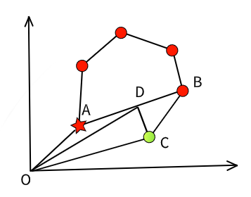

# 指令系统

指令系统用于飞行模式切换，飞行路径规划，设置控制目标值

```
.
├── Receiver/ 调用驱动接口获取遥控器指令
├── ManualControl/ 处理遥控器指令，模式切换
|   ├── armhandler.c 解锁上锁检查
|   |── pathplannerhandler.c
|   |── pathfollower.c
|   └── ...
|   
|── FlightPlan/ 飞行计划状态，控制
|── Stabilization/ 姿态控制
|── PathPlanner/ 路径点切换，设置飞行路径
└── PathFollower/ 
    ├── pathfollower.cpp 根据机型切换执行逻辑
    |── pidcontrole.cpp 位置控制，速度控制封装
    |── vtolautotakeoffcontroller.cpp  
    |── vtolautotakeofffsm.cpp 起飞动作分为慢启动，拉升，稳定内部状态机切换
    |── vtolflycontroller.cpp 
    |── vtollandcontroller.cpp 
    |── vtollandfsm.cpp 
    └── ...
```

## 飞行模式
### 自主模式
最常见的自主飞行模式，用户通过地面站设置路径点

飞控运行规划逻辑控制飞行器按照预期航线飞行，实现
[逻辑](https://github.com/SantyPilot/SantyPilot/blob/master/flight/libraries/paths.c#L140)

 <table rules="none" align="right">
  <tr>
    <td>
      
    </td>
  </tr>
</table>

在大地坐标系下，几个关键点位置关系如上图所示，其中

红色为用户设置路径点，红色星号为起飞点，圆圈为一般路径点，飞行器逆时针绕圈飞行

绿色为某瞬时飞行器所在位置，为了方便理解，图中标注惯性系与坐标原点$$O$$

- $$\vec{OA}$$为起飞点矢量
- $$\vec{AB}$$为预期航线
- $$\vec{OC}$$为飞行器某瞬时位矢。显然，它偏离了预期路径
- $$D$$为飞行器位置在预期航线的投影点，$$\vec{OD}$$为其位矢

则位置环控制目标点由$$\vec{CD}$$定义

位置控制由两个PID环路完成，
[外环](https://github.com/SantyPilot/SantyPilot/blob/master/flight/modules/PathFollower/pidcontrolne.cpp#L155C20-L155C43)控制位置，
[内环](https://github.com/SantyPilot/SantyPilot/blob/master/flight/modules/PathFollower/pidcontrolne.cpp#L166)控制速度

内环路输出作为姿态目标，输出给增稳模块，保证运动稳定

### 手动增稳
手动模式是用户操纵微调，作为姿态环参考点

## 模式切换
