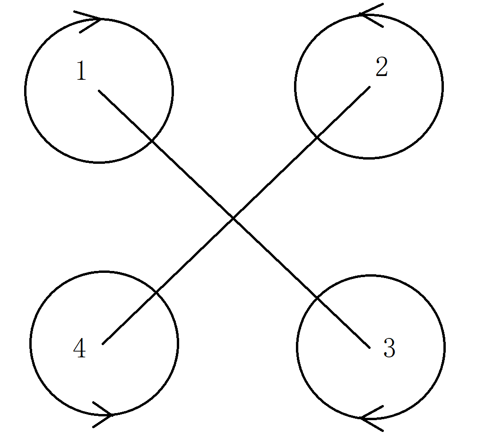
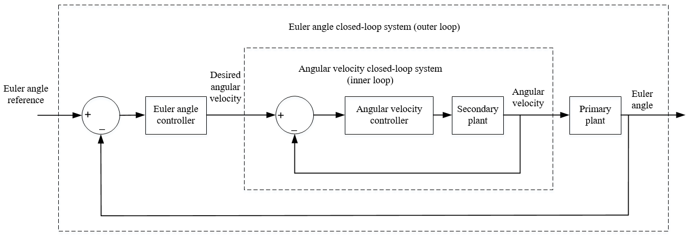

# 控制原理

## 四旋翼飞行状态规律
四旋翼是一个欠驱动系统。它的前后、左右、上下、左右旋转飞行依赖于姿态俯仰、滚转、油门变化、偏航来进一步完成

通常，电机产生的拉力与其转速为平方正比关系，即某个电机产生的拉力可以表达为$$T=c_T\tilde{\omega}^2$$。

其中常量$$c_T$$是一个转化率，显然与螺旋桨效率有关

根据X四旋翼的几何关系，将力矩代入，有

$$\left[\begin{array}{c}
\ddot{\phi} \\
\ddot{\theta} \\
\ddot{\psi} \\
T
\end{array}\right]=\left[\begin{array}{cccc}
k & -k & -k & k \\
k & k & -k & -k \\
k & -k & k & -k \\
k & k & k & k
\end{array}\right]\left[\begin{array}{c}
\varpi_{1}^{2} \\
\varpi_{2}^{2} \\
\varpi_{3}^{2} \\
\varpi_{4}^{2}
\end{array}\right]$$

如下为典型X型四旋翼示意图
<table class="copter">
  <tr>
    <td>
      
    </td>
  </tr>
</table>

可见，1，2电机一组，3，4电机一组，组内同时提高/降低转速可以实现俯仰运动；

1，4电机一组，2，3电机一组，可以实现滚转运动；

1，3一组，2，4一组，则可以实现偏航运动；

四个电机同时提高（降低）转速则飞行器向上（向下）运动

## PID控制器

使用比例-积分-微分控制器完成对线性模型控制

$$u(t)=K_{p} e(t)+K_{i} \int_{0}^{t} e(\tau) d \tau+K_{d} \frac{d}{d t} e(t)$$

其中
- $$e(t)$$为当前时刻的误差
- $$K_p$$,$$K_i$$,$$K_d$$为比例积分微分增益
- $$u(t)$$计算结果作为控制量输入给系统

增益需要调试确定
- 比例系数可以用来加快调节，但是过大会引起系统响应幅度过大，甚至不稳定
- 积分项用来减少稳态误差，但是过大会引起系统迟滞
- 微分项是瞬态的考量，可以预测误差变化趋势，但是过大会引起系统过于敏感

采用串级PID（Cascading PID）以达到更好的控制效果。

[外环](https://github.com/SantyPilot/SantyPilot/blob/master/flight/modules/Stabilization/outerloop.c)控制角度，
[内环](https://github.com/SantyPilot/SantyPilot/blob/master/flight/modules/Stabilization/innerloop.c)控制角速度，如下图

<table align="center">
  <tr>
    <td>
      
    </td>
  </tr>
</table>

